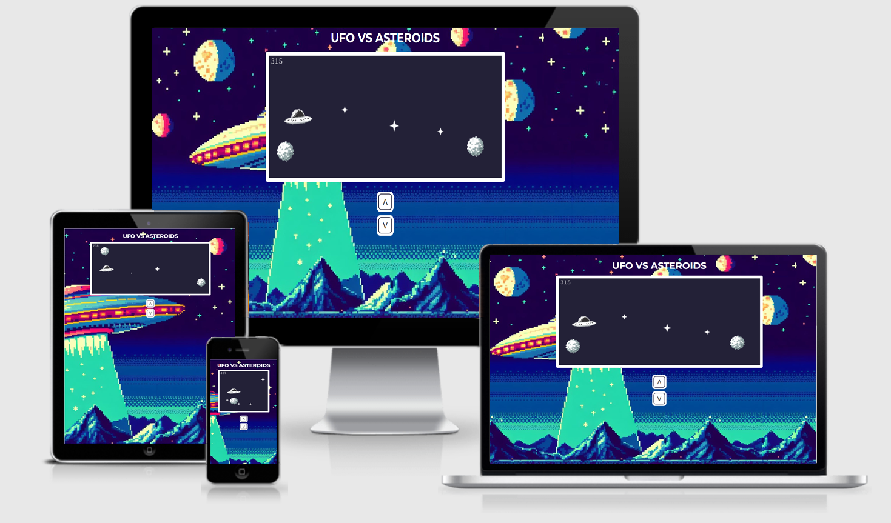
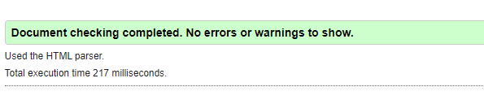
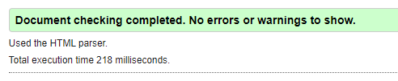
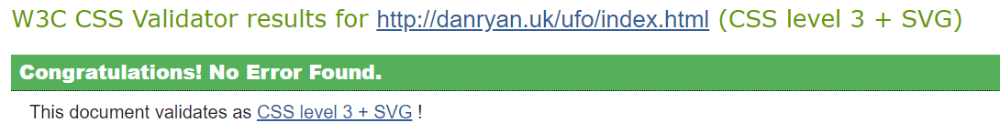
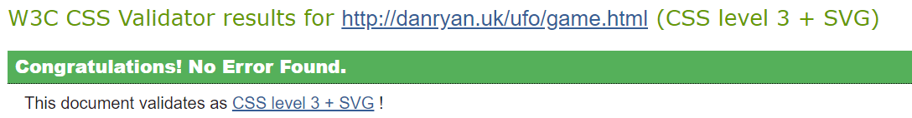

# **Javascript UFO Game**

## **Site Overview**
Based on the hidden game within Google's "no internet connection" window, this version is just as simple and just as addictive. Featuring a UFO that you need to guide through an asteroid field, it makes a great simple game to play while taking a break from more concentrated tasks.

# Table of contents 
1. [**Site Overview**](#site-overview)
1. [**(UX) User Experience**](#ux-user-experience)
    * [***Target Audiences***](#target-audiences)
    * [***User Stories***](#user-stories)
    * [***Site Aims***](#site-aims)
    * [***How This Will Be Achieved***](#how-is-this-will-be-achieved)
    * [***Wireframes***](#wireframes)
    * [***Colour Scheme***](#colour-scheme)
1. [**Individual Page Features**](#individual-page-content-features)
    * [**Home Screen**](#home-screen)
    * [**Game Screen**](#game-screen)
1. [**Testing Phase**](#testing-phase)
    * [**During Development Testing**](#during-development-testing)
    * [**Manual Testing**](#manual-testing)
    * [**Bugs & Fixes**](#bugs-and-fixes)
    * [**Post Development Testing**](#post-development-testing)
1. [**Deployment**](#deployment)
1. [**Future Enhancements**](#future-enhancements)
1. [**Credits**](#credits)

## **(UX) User Experience**
### **Target Audiences:**
* The target audience is anyone that is looking to pass a few minutes away from work or any task that requires heavy concentration.
* Fans of Google's Dino Runner game. 

### **User Stories:**
As a user I want to...
* Play a simnple game that can distract me for a few minutes
* Easily understand the games controls
* Easily find out any instructions needed to play the game
* Access and play the game in the quickest way possible

### **Site Aims:**
* To provide a quick and simple game for the user to play.
* Provide any instructions and controls in the simplest form possible.
* Provide the ability to play on mobile and desktop.
* Be easy to use / control for any age capable of using a computer in its simplest form.

### **How This Will Be Achieved:**
The site will have a home screen with the following:
* A still screen of what the game looks like so the user can see what to expect
* A simple set of instructions outlining the aim of the game and the controls
* A button to start game

### **Wireframes**

### **Colour Scheme**
To make it easy to see and stick with a space theme, the game screen itself will be a dark blue background to simulate space. My original idea to use black was too dark. The characters on screen will be with white/light grey characters.
The prodominant colours across the site will be dark blue and white, with a pixelated theme.
For the background I will be using a retro, arcade style ufo background.

### **Typography**
I have used a custom font for the initial 'Alien' language, which will then change to Monserat.

### **Technologies Used**
* HTML
* CSS
* Javascript

## **Individual Page Content features**
## **Home Screen**
* Logo heading along the top
* Button for 'Start Game'
* Information for instructions and controls  

## **Game Screen**
* Logo heading along the top
* Game area
* Additional controls for mobile play
* Game ove pop up with main menu and new game buttons

## **Testing Phase**
### **During Development Testing**
During the development process, I continually carried out manual testing in the following ways:-

* JEST testing.

* Manually testing each element for appearance and responsiveness via Google Chrome dev tools.

* Continually tested in multiple browsers.
    
* Published the page via a web-hosted server and shared it with friends and family to test.

### **Manual Testing:**
* During testing, I used five different browsers to ensure cross-compatibility. The desktop browsers used myself were:

  1. Chrome
  2. firefox  
  3. Opera
  4. Edge
  5. Safari

* I then used the dev tools to simulate different screen sizes/devices from 320 px up to 4000 px in width. 
* In addition to this, I also asked several people to test using iPhones and Apple Mac laptops/desktops. These users reported no issues or bugs.

### **Testing User Stories**
## Play a simnple game that can distract me for a few minutes

    - The game can be quickly started and the usual play time is anywhere from a few seconds to a minute.

    - The game can be played multiple times within a short time span.

## Easily understand the games controls

    - The controls can be found on the home screen and is one of the first things the user sees.

## Easily find out any instructions needed to play the game

    - The controls can be found on the home screen and is one of the first things the user sees.

## Access and play the game in the quickest way possible

    - The game can be played on Mobile, Tablet and Desktop.

    - The game can be loaded up and started within a few seconds.

### ***Bugs and Fixes:***
* Issue: UFO Image is not displayed on the canvas. Dev console throws failed to execute 'drawImage', Overload resolution failed, error.
* Fix: I had the incorrect sizing down for the draw method within the canvas. Setting the correct size cleared the error.

* Issue: Asteroids leave ghost images across two thirds of the screen. 
* Fix: Had the gamearea.height and game.width round the wrong way on the clear canvas method.

* Issue: Moving the UFO increases the speed of the asteroids.
* Fix: Had canvas animation frame updating after every button press causing the move speed to stack. Removed the requestAnimationFrame method from UFO movement function.

### **Post Development Testing**
#### **Validators**

#### ***HTML*** - https://validator.w3.org/nu/

* index.html

* game.html

#### ***CSS*** - https://jigsaw.w3.org/css-validator/

* index.html

* game.html

### **Lighthouse Scores**
#### ***index.html***

#### ***game.html***

## **Deployment**
I have deployed the live site to my own dowmain. Which can be found at
[UFO VS ASTEROIDS](http://danryan.uk/ufo)

## **Future Enhancements**
* I would like to imrove the images for the UFO and Asteroids, create them as svg files for a better resolution and scaling.
* Add further support for screen detection in mobile landscape mode.
* Further refine the collision detection box.
* Add a way for the user to log and save their high scores.

## **Credits**
* Alien font from Glipervelz at Dafont.com - [DaFont](https://www.dafont.com/glipervelz.font)
* All other fonts are from Google Fonts - [Google Fonts](https://fonts.google.com)
* Collison detection code from ImKennyYip at github - [GitHub](https://github.com/ImKennyYip/chrome-dinosaur-game)
* Background and characters generated using Bing's AI image generator - [Bing](https://bing.com)
* Image modifications were done using Adobe Photoshop - [Adobe](https://www.adobe.com)
